# Breakdown Breaker

Breakdown breaker is a utility mobile application which gives you information about the mechanical services surrounding you and help in contacting them.
This app will be highly useful if you are travelling to some unknown place and your vehicle brokedown suddenly and you have no idea about mechanics at that place,
having this app makes the mechnical services just a call away.
### Tech and Tools
 - Developed on android studio using java
 - Firbase for backend storage of data and authentication
 - Google maps api.

## Detailed view
 
- Firstly the user is authenticated using google sigin or email password signin methods provided by firebase.
- As soon as user logs in and grants necessary permissions he can see his current location on a map and this will be updated realtime.
- On the map user can also see the mechanical shops around him along with distance updated realtime.
- He can click on a marker and know more about that shop and can contact them if needed.
- User can also add or delete his own mechanical shops.
  
## Screenshots
|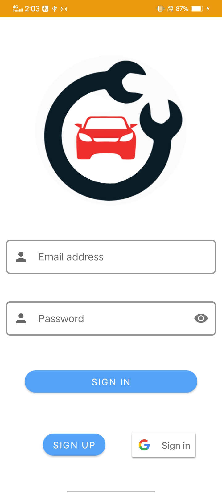||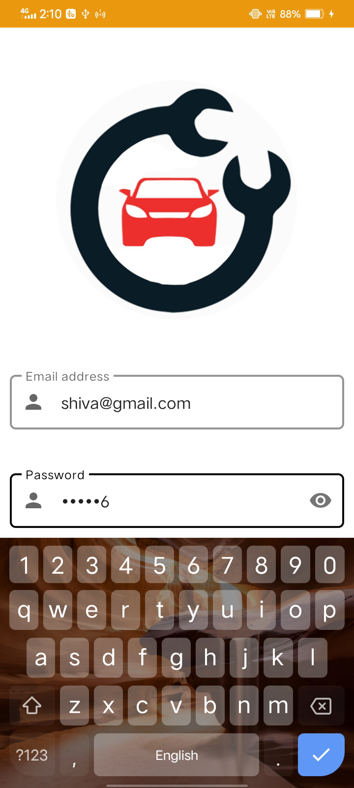|
| :--------: | :-----------: | :-------: |
|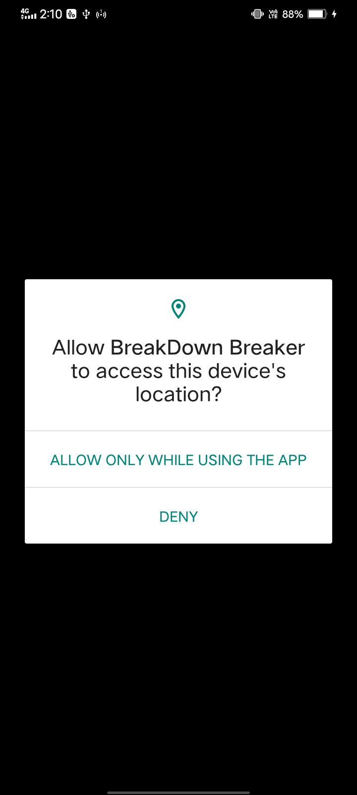|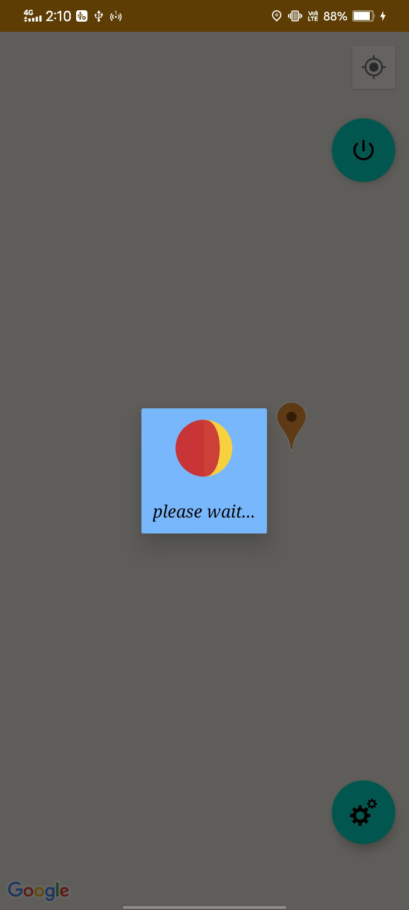|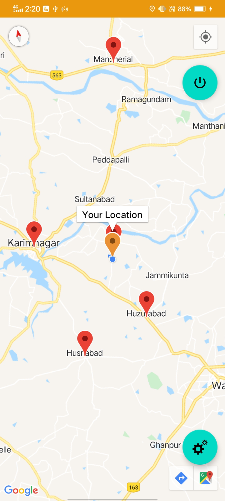|
|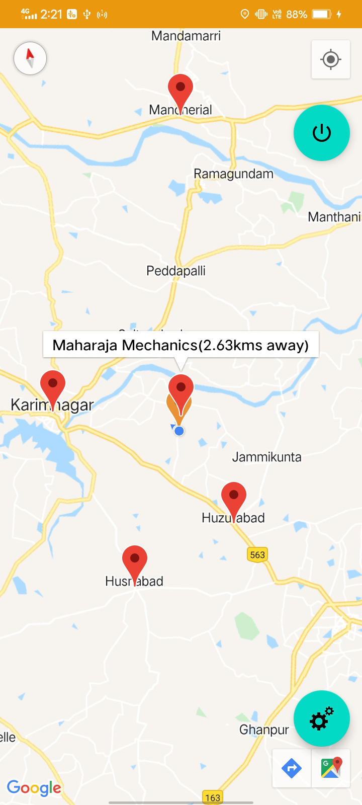|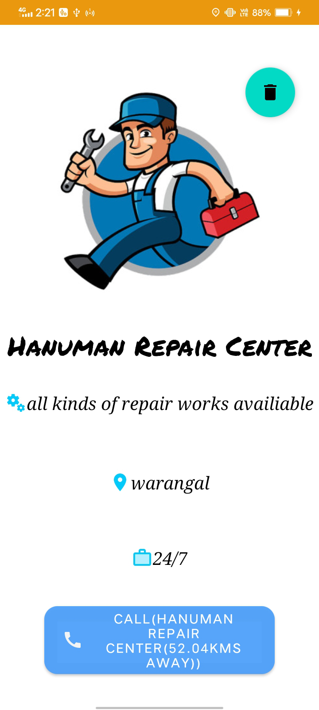|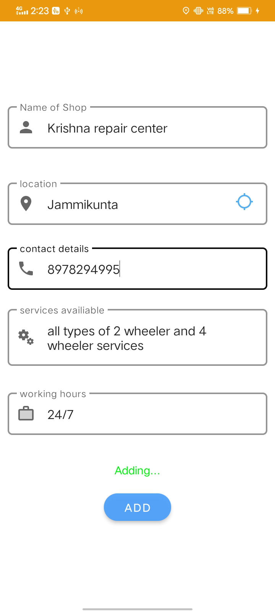|
|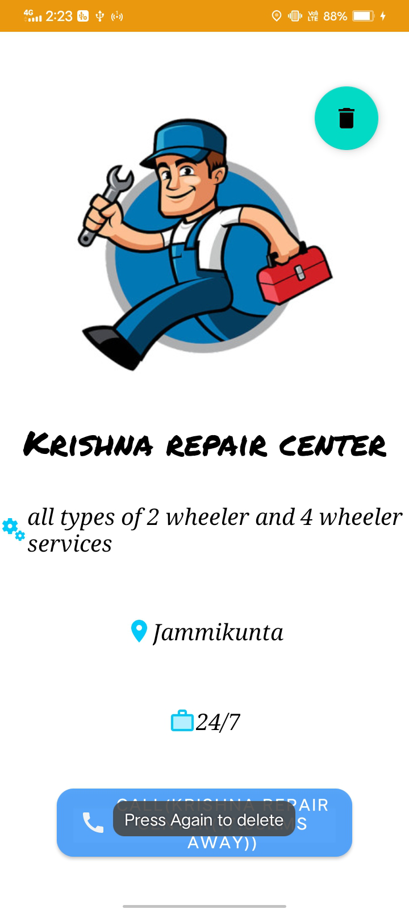|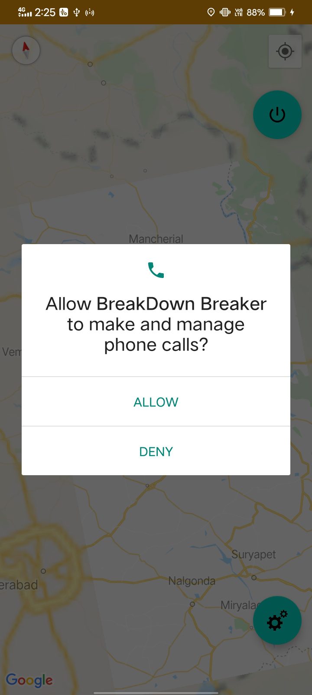|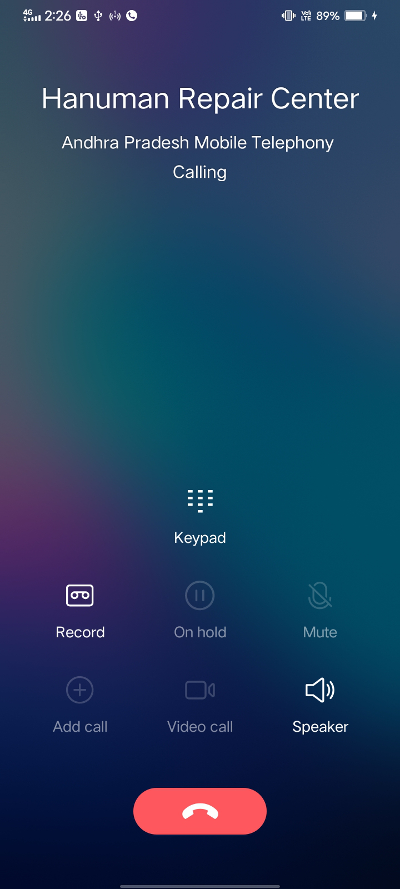|
